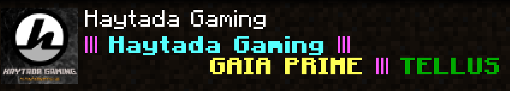

  


Welcome to the Haytada Gaming "splash" page! A little bit about us, we are a gaming community that was started around the beginning of 2020 and since then have started to grow, slowly. We will happily welcome anyone into our various platforms, all we ask is that you want to engage and become a part of the community. We have a Discord server that is the main central point for communication as well as our newest addition... our own dedicated Minecraft server. Check out below where you can see all the places that we are active and come join us!  
  
  
[](https://discord.gg/GrQgQTS)
[](https://twitch.tv/haytada)
[](https://www.youtube.com/channel/UCq47SvfvPnVSp7m5DLXZW7Q)
[](https://www.twitter.com/haytadagaming)
[](https://steamcommunity.com/groups/haytada)
[](https://www.reddit.com/r/haytadagaming/)  

Learn how our currency system works on Discord [here](https://haytadagaming.xyz/currency).

----

# Community Subreddit

----

We've launched a subreddit! Check out [r/haytadagaming](https://www.reddit.com/r/haytadagaming/) or click on the icon at the top!

----

# Patreon

----

Consider supporting the community on Patreon for exclusive Discord related content as well as Minecraft in-game perks. Take a look at the page by clicking on the button:

[](https://www.patreon.com/haytada)

### Our Patrons:

- Serenscorpio (Tier 1)

----

# Minecraft Server

----

  

We have our very own dedicated Minecraft Server! Either take your time, mine and build something spectacular in our **Gaia Prime** world or go all out in our **Tellus** PvP world that we wipe once a month. You can find the details to log on below:  

> IP: mc.haytadagaming.xyz  
> Please join our Discord (link above) to familiarise yourself with the rules. 

```html
<iframe src="https://discordapp.com/widget?id=421989895020609537&theme=dark" width="350" height="500" allowtransparency="true" frameborder="0" sandbox="allow-popups allow-popups-to-escape-sandbox allow-same-origin allow-scripts"></iframe>
```
